# 🔬 Multi-Agent AI Deep Researcher

A **production-grade, multi-agent research system** that takes any research topic and produces a comprehensive, fact-checked, structured report — complete with confidence scores, contradiction detection, and strategic insights.

Built with **LangGraph** (agent orchestration), **Tavily** (web search / RAG), **OpenRouter** (LLM access), and **Streamlit** (UI).

---
## Demo Link
- https://drive.google.com/file/d/1a_9TVrPsB0igHGAorDpUwuonrXC-Im_u/view?usp=drive_link

## Table of Contents

- [What It Does](#what-it-does)
- [Architecture Overview](#architecture-overview)
- [Agent Interaction Flow](#agent-interaction-flow)
- [The 6 Agents — Detailed](#the-6-agents--detailed)
- [Reflection Loop (Self-Critique)](#reflection-loop-self-critique)
- [Dynamic Parameters](#dynamic-parameters)
- [Project Structure](#project-structure)
- [Quick Start](#quick-start)
- [Configuration Reference](#configuration-reference)
- [Technology Stack](#technology-stack)
- [Output Format](#output-format)

---

## What It Does

You provide a research topic (e.g., *"Impact of AI on healthcare costs in 2024"*), and the system:

1. **Decomposes** the question into focused sub-queries for multi-hop coverage
2. **Searches** the web via Tavily API, collecting diverse sources
3. **Analyzes** findings — extracts claims, detects contradictions, identifies gaps
4. **Fact-checks** every claim — assigns confidence scores (0-100%), flags disputes
5. **Generates insights** — hypotheses with reasoning chains, trends, implications
6. **Compiles a structured report** with quality scoring
7. **Self-critiques** — if quality is below threshold, it loops back with follow-up queries

The output is a professional report with executive summary, confidence-rated findings, and downloadable PDF/Markdown.

---

## Architecture Overview

```
+---------------------------------------------------------------------+
|                                                                     |
|                     LANGGRAPH STATE GRAPH                           |
|                                                                     |
|  +---------------------------------------------------------------+  |
|  |                  Shared ResearchState                          |  |
|  | (original_query, sub_queries, sources, analysis, fact_check,  |  |
|  |  insights, report, iteration, quality_score, errors)          |  |
|  +---------------------------------------------------------------+  |
|                                                                     |
|  User Query                                                         |
|      |                                                              |
|      v                                                              |
|  +------------+  +------------+  +------------+  +------------+    |
|  | Decomposer |->| Retriever  |->|  Analyzer  |->|Fact-Checker|    |
|  |   Agent    |  |   Agent    |  |   Agent    |  |   Agent    |    |
|  |            |  |            |  |            |  |            |    |
|  | LLM-based  |  | Tavily API |  | LLM-based  |  | LLM-based  |    |
|  +------------+  +------------+  +------------+  +-----+------+    |
|       ^                                                |           |
|       |                                                v           |
|       |          +------------+  +------------+  +------------+    |
|       |          |  Quality   |<-|   Report   |<-|  Insight   |    |
|       |          |   Gate     |  |   Agent    |  |   Agent    |    |
|       |          |            |  |            |  |            |    |
|       |          | Conditional|  | LLM-based  |  | LLM-based  |    |
|       |          +-----+------+  +------------+  +------------+    |
|       |                |                                           |
|       |        +-------+-------+                                   |
|       |        |               |                                   |
|       |   quality >= 65   quality < 65                             |
|       |   OR max iter     AND iter < max                           |
|       |        |               |                                   |
|       |        v               |                                   |
|       |     [PASS] END         |                                   |
|       |  (Return Report)       |                                   |
|       |                        |                                   |
|       +------------------------+                                   |
|            REFINE (loop back with follow-up queries)               |
|                                                                     |
+---------------------------------------------------------------------+
```

---

## Agent Interaction Flow

### Step-by-Step Walkthrough

```mermaid
flowchart LR
    subgraph S1 ["Step 1: Decompose"]
        Q["Complex Query"] --> D["Decomposer"]
        D --> SQ1["Sub-Query 1"]
        D --> SQ2["Sub-Query 2"]
        D --> SQ3["Sub-Query 3"]
    end

    subgraph S2 ["Step 2: Retrieve"]
        SQ1 --> T["Tavily Search"]
        SQ2 --> T
        SQ3 --> T
        T --> DEDUP["Deduplicate\n& Categorize"]
    end

    subgraph S3 ["Step 3–6: Analyze → Report"]
        DEDUP --> AN["Analyze"]
        AN --> FC["Fact-Check"]
        FC --> IN["Insights"]
        IN --> RP["Report"]
    end

    style S1 fill:#eaf2f8,stroke:#3498db
    style S2 fill:#eafaf1,stroke:#2ecc71
    style S3 fill:#f5eef8,stroke:#9b59b6
```



---

### Step 1 — Query Decomposition

| | |
|---|---|
| **Agent** | Query Decomposer (LLM) |
| **Input** | User's research question |
| **Output** | 2–5 focused sub-queries |
| **Why** | A complex question like *"Impact of AI on healthcare costs vs education 2024"* is actually 3 questions. Decomposing ensures multi-angle coverage. |

**Example:**
> **Input:** "Impact of AI on healthcare costs vs education spending in 2024"
>
> **Output sub-queries:**
> 1. "AI impact on healthcare costs 2024 statistics"
> 2. "AI spending in education sector 2024"
> 3. "healthcare vs education AI investment comparison"

---

### Step 2 — Web Retrieval

| | |
|---|---|
| **Agent** | Retriever Agent (Tavily API) |
| **Input** | Sub-queries from Step 1 |
| **Output** | 12–18 deduplicated, categorized sources |
| **Why** | Each sub-query gets its own search pass. Results are deduplicated by URL and categorized (news, academic, government, blog, etc.) |

---

### Step 3 — Critical Analysis

| | |
|---|---|
| **Agent** | Analysis Agent (LLM) |
| **Input** | All collected sources |
| **Output** | Executive summary, extracted findings, contradictions, gaps, source assessments |
| **Why** | Raw sources need synthesis. This agent pulls out specific claims with citations and flags where sources disagree. |

---

### Step 4 — Fact Verification

| | |
|---|---|
| **Agent** | Fact-Checker Agent (LLM) |
| **Input** | Findings from Step 3 + original sources |
| **Output** | Each claim scored 0–100% confidence with verification status |
| **Why** | Not all findings are equally trustworthy. Cross-referencing across sources separates well-supported facts from single-source claims. |

**Confidence Scoring Guide:**

| Score | Meaning |
|-------|---------|
| 90–100% | Multiple high-authority sources agree — well-established fact |
| 70–89% | Most sources agree, supported by credible evidence |
| 50–69% | Mixed evidence, some caveats apply |
| 30–49% | Limited evidence, only 1–2 low-authority sources |
| 0–29% | Disputed, contradicted, or unverifiable |

---

### Step 5 — Insight Generation

| | |
|---|---|
| **Agent** | Insight Agent (LLM) |
| **Input** | Verified findings + gaps + fact-check results |
| **Output** | Hypotheses (with reasoning chains), trends, patterns, implications, follow-up questions |
| **Why** | Goes beyond summarization to provide forward-looking, strategic analysis grounded in evidence. |

---

### Step 6 — Report Compilation + Quality Gate

| | |
|---|---|
| **Agent** | Report Agent (LLM) |
| **Input** | All previous agent outputs |
| **Output** | Structured report + quality score (0–100) |
| **Why** | Compiles everything into a professional report and self-evaluates research quality. If quality is below threshold, the pipeline loops back. |


---

### What Happens During a Reflection Loop?

| | Iteration 1 | Iteration 2 |
|---|---|---|
| **Query** | "Impact of AI on healthcare" | Follow-up: "AI healthcare cost case studies" |
| **Sources** | 12 found | 12 + 8 new = **20 total** |
| **Quality** | 55/100 — **below threshold** | 78/100 — **above threshold** |
| **Gaps** | "Missing cost reduction data", "No case studies" | Gaps filled |
| **Result** | Loop back with targeted sub-queries | Report accepted |

Sources **accumulate** across iterations — the system builds on previous research rather than starting over.

---

## The 6 Agents — Detailed

| # | Agent | Role | Input | Output | API Used |
|---|-------|------|-------|--------|----------|
| 1 | **Query Decomposer** | Breaks complex queries into 2-5 atomic sub-queries | User's research question | List of focused sub-queries | LLM (OpenRouter) |
| 2 | **Retriever Agent** | Searches the web, collects & deduplicates sources | Sub-queries from decomposer | List of SourceDocuments (title, URL, content, type) | Tavily Search API |
| 3 | **Analysis Agent** | Summarizes findings, detects contradictions, identifies gaps | All collected sources | Executive summary, findings, contradictions, gaps | LLM (OpenRouter) |
| 4 | **Fact-Checker Agent** | Cross-validates claims, assigns confidence scores | Analysis findings + sources | Verified claims with 0-100% confidence scores | LLM (OpenRouter) |
| 5 | **Insight Agent** | Generates hypotheses, identifies trends, reasoning chains | Verified findings + gaps | Hypotheses, trends, patterns, implications | LLM (OpenRouter) |
| 6 | **Report Agent** | Compiles structured report, evaluates quality | All previous outputs | Final report + quality score (0-100) | LLM (OpenRouter) |

### How Agents Share State

All agents read from and write to a shared **`ResearchState`** (a Python `TypedDict`):

```python
class ResearchState(TypedDict, total=False):
    original_query: str          # User's question
    sub_queries: list[str]       # Decomposed sub-queries
    sources: list[dict]          # Collected web sources (accumulates)
    analysis: dict               # Analysis findings
    fact_check: dict             # Verified claims + confidence
    insights: dict               # Hypotheses + trends
    report: dict                 # Final compiled report
    iteration: int               # Current loop iteration
    max_iterations: int          # Max allowed loops
    quality_score: float         # Report quality (0-100)
    status: str                  # Current pipeline status
    errors: list[str]            # Any errors encountered
```

Each agent **reads** what it needs and **writes** its output. LangGraph handles the state merging automatically.

---

## Reflection Loop (Self-Critique)

The system doesn't just produce a report — it **evaluates its own work** and refines if needed.

```
Quality Score Calculation (by Report Agent):
┌──────────────────────────────────────────────┐
│  Coverage (0-25 pts)                         │
│    Were all aspects of the query addressed?  │
│                                              │
│  Source Diversity (0-20 pts)                 │
│    Mix of news, academic, government, etc.?  │
│                                              │
│  Verification (0-25 pts)                     │
│    Were claims cross-verified across sources?│
│                                              │
│  Depth (0-15 pts)                            │
│    Beyond surface-level information?         │
│                                              │
│  Coherence (0-15 pts)                        │
│    Well-structured and readable?             │
│                                              │
│  TOTAL: 0-100 points                         │
└──────────────────────────────────────────────┘
```

**Decision logic** in the Quality Gate:

```
IF quality_score >= QUALITY_THRESHOLD → ✅ Accept report, return to user
ELIF iteration >= MAX_ITERATIONS      → ⚠️ Accept (best effort), return to user
ELSE                                  → 🔄 Loop back with follow-up queries
```

---

## Dynamic Parameters

These parameters can be adjusted in the **Streamlit sidebar** at runtime or via `config.py` / `.env`:

### User-Adjustable (via Sidebar)

| Parameter | Default | Range | What It Controls |
|-----------|---------|-------|-----------------|
| **LLM Model** | `Gemini 2.0 Flash (Free)` | Dropdown | Which AI model powers the agents. Free models available. |
| **Max Reflection Loops** | `2` | 1 – 3 | How many times the system can loop back to refine research if quality is low. Higher = more thorough but slower. |
| **Quality Threshold** | `65` | 30 – 90 | Minimum quality score (0-100) to accept the report. Lower = faster, Higher = more thorough. |

### Developer-Configurable (via `config.py` or `.env`)

| Parameter | Default | Description |
|-----------|---------|-------------|
| `DEFAULT_MODEL` | `google/gemini-2.0-flash-exp:free` | Default LLM model (OpenRouter model string) |
| `MAX_TOKENS` | `4096` | Max tokens per LLM response |
| `TEMPERATURE` | `0.2` | LLM creativity (0 = deterministic, 1 = creative) |
| `REQUEST_TIMEOUT` | `90` seconds | Timeout for each API call |
| `MAX_SEARCH_RESULTS` | `6` | Tavily results per sub-query (5-8 recommended) |
| `MAX_SUB_QUERIES` | `5` | Max sub-queries the decomposer can generate |
| `DEBUG_LLM` | `false` | Set to `true` to log full LLM prompts/responses |
| `CHROMA_PERSIST_DIR` | `.chroma` | ChromaDB storage path |
| `PDF_OUTPUT_DIR` | `outputs` | Where generated PDFs are saved |

### How Parameters Affect Behavior

```
                          SPEED vs THOROUGHNESS
  ◄──────────────────────────────────────────────────────────►
  FAST                                                   THOROUGH

  Max Iterations: 1          Max Iterations: 3
  Quality Threshold: 30      Quality Threshold: 85
  Max Sub-Queries: 2         Max Sub-Queries: 5
  Max Search Results: 4      Max Search Results: 8
  Temperature: 0.1           Temperature: 0.3

  ~30 seconds                ~3-5 minutes
  ~5 sources                 ~20+ sources
  1 pass                     Up to 3 passes
```

---

## Project Structure

```
Group_2_project/
│
├── agents/                          # 🤖 All 6 specialized agents
│   ├── __init__.py                  #    Package docstring
│   ├── decomposer_agent.py          #    Breaks queries into sub-queries (LLM)
│   ├── retriever_agent.py           #    Web search + source collection (Tavily)
│   ├── analysis_agent.py            #    Critical analysis + contradiction detection (LLM)
│   ├── fact_checker_agent.py        #    Confidence scoring + cross-validation (LLM)
│   ├── insight_agent.py             #    Hypothesis generation + trend identification (LLM)
│   └── report_agent.py              #    Report compilation + quality evaluation (LLM)
│
├── orchestrator/                    # 🧠 LangGraph pipeline
│   ├── __init__.py                  #    Package docstring
│   ├── state.py                     #    ResearchState TypedDict (shared state)
│   └── graph.py                     #    StateGraph definition + conditional edges
│
├── prompts/                         # 📝 Separated prompt templates
│   ├── __init__.py                  #    Why prompts are in their own package
│   ├── decomposer_prompt.py         #    System + user prompts for decomposer
│   ├── retriever_prompt.py          #    System + user prompts for source categorization
│   ├── analysis_prompt.py           #    System + user prompts for analysis
│   ├── fact_checker_prompt.py       #    System + user prompts for fact-checking
│   ├── insight_prompt.py            #    System + user prompts for insight generation
│   └── report_prompt.py             #    System + user prompts for report building
│
├── utils/                           # 🔧 Shared utilities
│   ├── __init__.py                  #    Package docstring
│   ├── llm_client.py                #    OpenRouter LLM wrapper (retry, JSON parsing)
│   ├── pdf_export.py                #    Professional PDF generation (FPDF2)
│   └── callbacks.py                 #    Progress tracking for Streamlit UI
│
├── app.py                           # 🖥️  Streamlit UI (main entry point)
├── config.py                        # ⚙️  Central configuration (all settings)
├── requirements.txt                 # 📦 Pinned Python dependencies
├── .env.example                     # 🔑 API key template (safe to commit)
├── .env                             # 🔒 Your actual API keys (NEVER commit)
├── .gitignore                       # 🚫 Git ignore rules
└── README.md                        # 📖 This file
```

---

## Quick Start

### Prerequisites

- **Python 3.11+**
- **OpenRouter API Key** — [openrouter.ai/keys](https://openrouter.ai/keys) (free tier available)
- **Tavily API Key** — [tavily.com](https://tavily.com) (1,000 free searches/month)

### Installation

```bash
# 1. Clone and navigate to the project
cd Group_2_project

# 2. Create a virtual environment
python3 -m venv venv
source venv/bin/activate        # macOS/Linux
# venv\Scripts\activate          # Windows

# 3. Install dependencies
pip install -r requirements.txt

# 4. Configure API keys
cp .env.example .env
# Edit .env and add your real API keys:
#   OPENROUTER_API_KEY=sk-or-...
#   TAVILY_API_KEY=tvly-...

# 5. Launch the app
streamlit run app.py
```

The app will open at **http://localhost:8501**.

### First Research

1. Type a research topic (or click an example)
2. Select an LLM model from the sidebar (free models work great)
3. Adjust **Max Reflection Loops** and **Quality Threshold** if desired
4. Click **🔍 Research**
5. Watch the 6 agents work in real-time
6. Explore results across tabs: Summary, Findings, Insights, Sources
7. Download as **PDF** or **Markdown** from the Export tab

---

## Configuration Reference

### Environment Variables (`.env`)

```bash
# Required
OPENROUTER_API_KEY=sk-or-your-key-here    # LLM access
TAVILY_API_KEY=tvly-your-key-here          # Web search

# Optional
DEFAULT_MODEL=google/gemini-2.0-flash-exp:free   # Override default model
DEBUG_LLM=false                                    # Enable verbose logging
```

### Available Models

| Model | Cost | Speed | Quality | Best For |
|-------|------|-------|---------|----------|
| Gemini 2.0 Flash | Free | Fast | Good | Default choice, great balance |
| DeepSeek V3 | Free | Medium | Good | Complex reasoning |
| Llama 3.1 8B | Free | Fast | Moderate | Quick experiments |
| Qwen 2.5 72B | Free | Medium | Good | Large context tasks |
| GPT-4o Mini | ~$0.15/1M tokens | Fast | Very Good | Production quality |
| Claude 3.5 Haiku | ~$0.25/1M tokens | Fast | Very Good | Precise analysis |
| Claude 3.5 Sonnet | ~$3/1M tokens | Medium | Excellent | Best quality output |

---

## Technology Stack

| Component | Technology | Purpose |
|-----------|-----------|---------|
| **Agent Orchestration** | [LangGraph](https://github.com/langchain-ai/langgraph) | StateGraph with typed state, conditional edges, reflection loop |
| **LLM Access** | [OpenRouter](https://openrouter.ai) + [OpenAI SDK](https://github.com/openai/openai-python) | Unified API for 100+ models (GPT, Claude, Gemini, Llama, etc.) |
| **Web Search (RAG)** | [Tavily](https://tavily.com) | Purpose-built AI search API with relevance scoring |
| **UI Framework** | [Streamlit](https://streamlit.io) | Professional web UI with real-time progress tracking |
| **PDF Generation** | [FPDF2](https://github.com/py-pdf/fpdf2) | Styled PDF reports with colored sections and badges |
| **Retry Logic** | [Tenacity](https://github.com/jd/tenacity) | Exponential backoff for API resilience |
| **Configuration** | [python-dotenv](https://github.com/theskumar/python-dotenv) | Secure API key management via `.env` files |

---

## Output Format

The final report includes:

| Section | Content |
|---------|---------|
| **Executive Summary** | 2-3 paragraph overview of key findings |
| **Key Findings** | Numbered list with confidence scores (color-coded: 🟢 70%+ / 🟡 50-69% / 🔴 <50%) |
| **Contradictions & Gaps** | Where sources disagree + what's missing |
| **Insights & Trends** | Hypotheses with reasoning chains, trend directions |
| **Source Reliability** | Assessment of overall source quality and diversity |
| **Quality Score** | 0-100 with breakdown (coverage, diversity, verification, depth, coherence) |
| **Sources Cited** | Full list with titles, URLs, and source types |

### Export Formats

- **PDF** — Professional document with styled sections, confidence badges, quality score box
- **Markdown** — Compatible with GitHub, Notion, Obsidian, and other tools

---

## Resilience & Error Handling

The system is designed to **never crash** — every agent has fallback logic:

| Scenario | What Happens |
|----------|-------------|
| LLM API call fails | Retries 3x with exponential backoff (2s → 4s → 8s) |
| JSON parsing fails | Falls back to regex extraction from LLM response |
| Tavily search fails | Skips that sub-query, continues with other results |
| Fact-checker fails | Marks all claims as "unverified" with warning |
| Report builder fails | Assembles basic fallback report from raw data |
| Quality gate fails | Accepts best available report |

---

## License

This project is built for educational and research purposes as part of Group 2's Capstone C4 submission.
