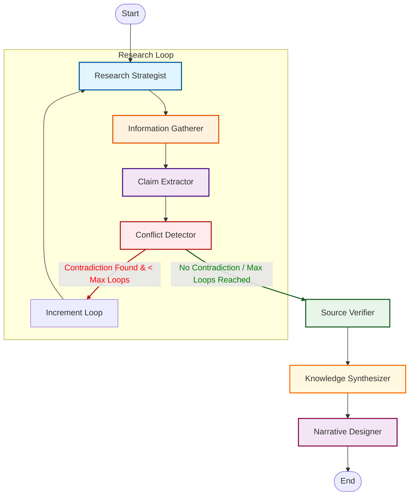

```mermaid
graph TD
    Start([Start]) --> Strategist[Research Strategist]
    
    subgraph Research Loop
        Strategist --> Gatherer[Information Gatherer]
        Gatherer --> Extractor[Claim Extractor]
        Extractor --> Detector[Conflict Detector]
        
        Detector -- "Contradiction Found & < Max Loops" --> IncrementLoop[Increment Loop]
        IncrementLoop --> Strategist
    end
    
    Detector -- "No Contradiction / Max Loops Reached" --> Verifier[Source Verifier]
    
    Verifier --> Synthesizer[Knowledge Synthesizer]
    Synthesizer --> Designer[Narrative Designer]
    Designer --> End([End])

    %% Node Descriptions
    style Strategist fill:#e1f5fe,stroke:#01579b,stroke-width:2px
    style Gatherer fill:#fff3e0,stroke:#e65100,stroke-width:2px
    style Extractor fill:#f3e5f5,stroke:#4a148c,stroke-width:2px
    style Detector fill:#ffebee,stroke:#b71c1c,stroke-width:2px
    style Verifier fill:#e8f5e9,stroke:#1b5e20,stroke-width:2px
    style Synthesizer fill:#fff8e1,stroke:#ff6f00,stroke-width:2px
    style Designer fill:#f3e5f5,stroke:#880e4f,stroke-width:2px

    %% Edge Labels
    linkStyle 4 stroke:#b71c1c,stroke-width:2px,color:red
    linkStyle 6 stroke:#1b5e20,stroke-width:2px,color:green
```
