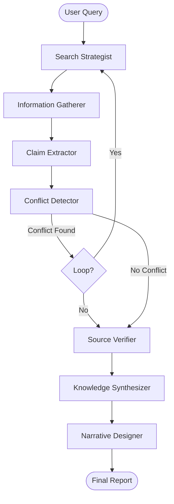

# 🕵️‍♂️ Agentic Research Engine (Group 4)

A powerful, autonomous deep research system powered by **AI Agents**. This engine can perform comprehensive web research, verify facts, detect contradictions, and synthesize findings into a cited report—all through a user-friendly Streamlit interface.

## 🚀 Key Features

-   **Multi-Step Research & Planning**: Breaks down complex queries into sub-questions using a **Search Strategist**.
-   **Autonomous Information Gathering**: Fetches data from **Tavily**, **Wikipedia**, and **Arxiv**.
-   **Intelligent Claim Extraction**: Isolates atomic claims from raw text for granular analysis.
-   **Contradiction Detection**: Automatically spots conflicting information across sources and triggers specific resolution loops.
-   **Hallucination Check (De-Bunker)**: Verifies claims against source text using **Cosine Similarity** (Fast Pass) and LLM verification (Slow Pass).
-   **Dynamic LLM Switching**: Seamlessly toggle between **Cloud Models (OpenRouter)** and **Local LLMs (LM Studio)** via the UI.
-   **Live Metrics Dashboard**: Track time, tokens, and tool usage in real-time.

---

## 🏗️ Architecture

The system is built on **LangGraph** with a stateful workflow of specialized agents:



### 🤖 The Agents
1.  **Search Strategist** (`research_strategist.py`): Decomposes the main query into targeted sub-questions.
2.  **Information Gatherer** (`information_gatherer.py`): Executes searches using configured tools (Tavily, Wiki, Arxiv).
3.  **Claim Extractor** (`claim_extractor.py`): Processes raw content to extract specific, verifiable claims.
4.  **Conflict Detector** (`conflict_detector.py`): Analyzes claims to find contradictions.
5.  **Source Verifier** (`source_verifier.py`): Checks claims against source text to prevent hallucinations.
6.  **Knowledge Synthesizer** (`knowledge_synthesizer.py`): Aggregates verified claims into a coherent answer.
7.  **Narrative Designer** (`narrative_designer.py`): Formats the final output into a professional markdown report.

---

## 🛠️ Installation

### Prerequisites
-   Python 3.10+
-   [LM Studio](https://lmstudio.ai/) (Optional, for local LLMs)

### 1. Clone the Repository
```bash
git clone <repository-url>
cd <repository-folder>
```

### 2. Set Up Virtual Environment
```bash
python -m venv .venv
source .venv/bin/activate  # On Windows: .venv\Scripts\activate
```

### 3. Install Dependencies
```bash
pip install -r requirements.txt
```

---

## ⚙️ Configuration

### 1. Environment Variables
Create a `.env` file in the root directory for your API keys:

```ini
# Required for Search
TAVILY_API_KEY="tvly-..."

# Required for Cloud LLMs (OpenRouter)
OPENROUTER_API_KEY="sk-or-..."
OPENROUTER_BASE_URL="https://openrouter.ai/api/v1"
LLM_MODEL="google/gemini-2.0-flash-lite-preview-02-05:free"

# Detailed Configuration
CONTRADICTION_THRESHOLD=0.9
MAX_SUB_QUESTIONS=5
```

### 2. Local LLM Configuration (`config.env`)
The system also reads from `config.env` for local settings. This file is pre-configured for LM Studio:

```ini
# Local Specifics
LOCAL_LLM_BASE_URL="http://localhost:1233/v1"
LOCAL_LLM_MODEL="local-model"
```
*Note: Ensure LM Studio is running its server on port `1233`.*

---

## 🖥️ Usage

### 1. Start the Application
Run the Streamlit UI with the helper script:
```bash
./run_ui.sh
```
Or manually:
```bash
streamlit run app.py
```

### 2. Using the Interface
1.  **Select Provider**: Choose between **OpenRouter** (Cloud) or **Local (LM Studio)** in the sidebar.
2.  **Enter Query**: Type your research question (e.g., *"What is the current state of Quantum Computing?"*).
3.  **Start Researchers**: Click "Start Research" and watch the agents work in the logs.
4.  **View Results**:
    -   **Final Report**: The synthesized article.
    -   **Claims**: All extracted claims with confidence scores.
    -   **Contradictions**: Any conflicts found during research.

---

## 📂 Project Structure

```
├── app.py                  # Main Streamlit Application
├── src/
│   ├── agents/             # Agent Implementations
│   │   ├── research_strategist.py
│   │   ├── information_gatherer.py
│   │   ├── claim_extractor.py
│   │   ├── conflict_detector.py
│   │   ├── source_verifier.py
│   │   ├── knowledge_synthesizer.py
│   │   └── narrative_designer.py
│   ├── config.py           # Configuration Management
│   ├── graph.py            # LangGraph Orchestration
│   └── state.py            # Global State Definition
├── config.env              # Local LLM Config
├── requirements.txt        # Python Dependencies
└── run_ui.sh               # Startup Script
```

---

## � Methodology & Attribution

This project follows the **Get Shit Done (GSD)** methodology, designed for transparency and efficiency in autonomous development.

-   **Original Methodology**: [Get Shit Done](https://github.com/gsd-build/get-shit-done)
-   **Adapted for Antigravity**: [GSD for Antigravity](https://github.com/toonight/get-shit-done-for-antigravity)

We utilize this framework to ensure rigorous planning, state management, and empirical verification throughout the development lifecycle.

---

## �🤝 Contributing
1.  Fork the repo.
2.  Create your feature branch (`git checkout -b feature/AmazingFeature`).
3.  Commit your changes (`git commit -m 'Add some AmazingFeature'`).
4.  Push to the branch (`git push origin feature/AmazingFeature`).
5.  Open a Pull Request.

---

**Built with ❤️ for Outskill Hackathon - Group 4**
